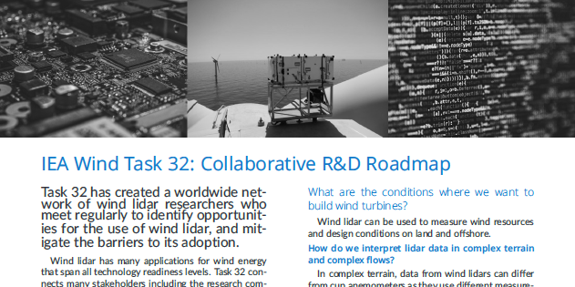

Last release: 1 December 2019 

# IEA Wind Task32 Collaborative R&D Roadmap
IEA Wind Task 32 coordinates a range of research and development activities for wind lidar for wind energy applications. In order to help Task members and others keep an overview of what's happening in the Task, we have created this  roadmap.

Some groups would call this document a _strategy_, but our activities change in response to our members' needs and resources. As a result this document serves more to keep everyone up-to-date with what's going on and where we are all headed; hence, 'roadmap'.

## Activities
To find out more about Task 32 activities, see the Task 32 website at https://community.ieawind.org/task32/home.

# Versions
This document will be updated regularly.

## Getting the most up-to-date version
If you just want to get the PDF of our roadmap, please visit https://doi.org/10.5281/zenodo.3374354. This link automatically resolves to the most recent version.

## Citing versions
We suggest using the digital object identifier or 'DOI' to refer to specific versions of the roadmap.

Click on https://doi.org/10.5281/zenodo.3374354 to see the most recent version. On this page you can also find a version history, and then go to the page for the version you want to cite. This approach allows you to find the DOI for a version, e.g.  for the 2019 December 1 version.

N.B: if you cite https://doi.org/10.5281/zenodo.3374354, you are citing  content that may change with time.

## Update history
- 2019 December 1: First written version. 
- 2019 October 21: Updated graphical version. 
- 2019 July 31: first graphical version. 
- 2019 December 1: first written version. ](https://doi.org/10.5281/zenodo.3604290)
- 2020 August 7:

# How to provide feedback to the roadmap
We welcome constructive feedback on the roadmap. There are two ways to provide feedback to this document.

## ... through Github
You can provide feedback to the roadmap by [raising an issue](https://github.com/IEA-Wind-Task-32/white-paper-Task32-RnD-roadmap/issues). Before you raise an issue, please take a few minutes to check if there is a similar one in the list already.

**You will have to be logged in to Github to provide feedback**. This means that your feedback will be associated with your username, which may make it possible to identify you. We prefer to have feedback associated with a name because the roadmap is a community document.

## ... via the IEA Wind Task 32 Operating Agent
Please send your feedback to [ieawind.task32@ifb.uni-stuttgart.de](mailto:ieawind.task32@ifb.uni-stuttgart.de). Please note that your email may be forwarded in its entirety to the rest of the author team. If you need anonymity, please indicate this in your email. Your email should include:
- **Section** What section of the roadmap does this feedback apply to?
- **Issue or challenge:** What is the problem, issue, or challenge?
- **Proposal:** What would you like to see instead?
- **More information:** Where can we get more information? Please provide e.g. a URL.

# About the repository

## Contents
This repository includes:
 - A banner image for use in the repository or elsewhere
 - All of the files required to produce the roadmap using the LaTeX document preparation system.
 - Defined releases, corresponding to the versions listed in the update history, above.

## Maintainer
 - Andy Clifton  
 - See https://doi.org/10.5281/zenodo.3374354 and specific releases for details of the author team.